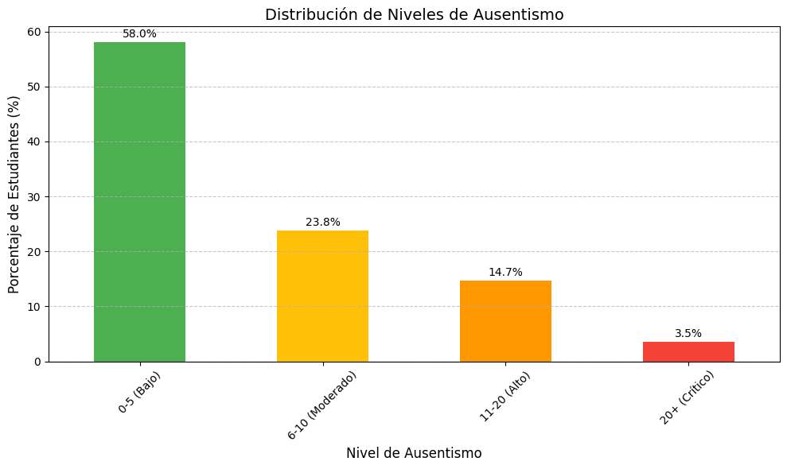
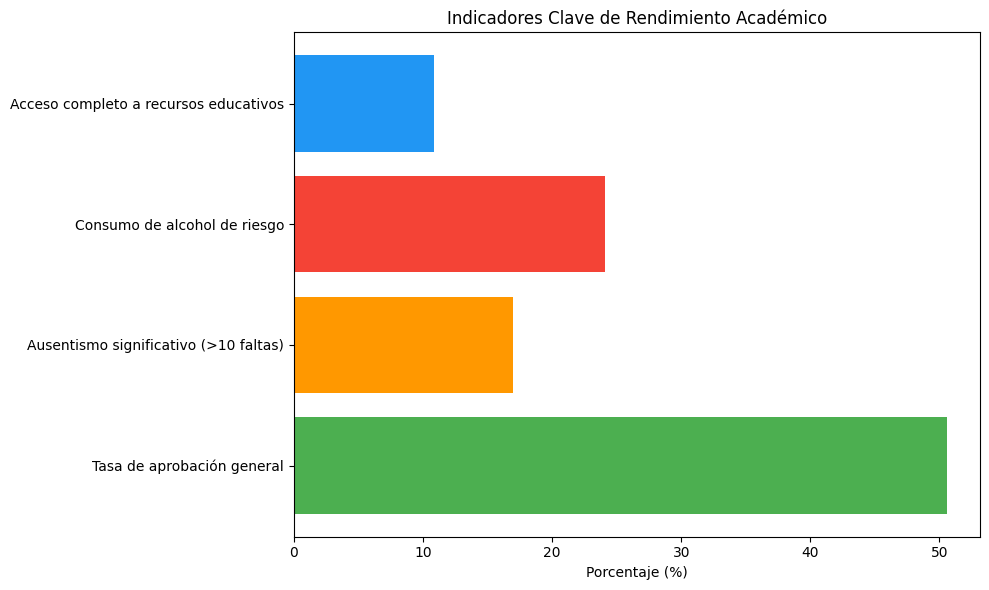
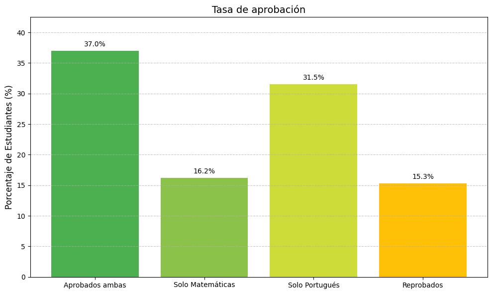

# Informe de Seguridad, Privacidad y Ética en Sistema Académico
**Integrantes** : Paolo Medrano Terán - César Pajuelo 

**Curso**: Ética y seguridad de los Datos

## 1. Introducción 

Este informe tiene como objetivo detallar las medidas de seguridad, privacidad y ética implementadas en el sistema académico distribuido. Se analiza el tratamiento de los datos académicos, la protección de la información personal de los estudiantes, y las estrategias utilizadas para garantizar la seguridad y el cumplimiento de normativas locales e internacionales.

## 2. Valor de los datos en el caso de negocio 

En este proyecto, se han definido varios **KPIs** para medir el valor generado por los datos y evaluar el impacto de las variables académicas, sociales y familiares en el rendimiento de los estudiantes. Se ha establecido una base de datos con la siguiente descripción de los atributos:

### Descripción de Atributos

1. **student_id**: Identificador único para cada estudiante.
2. **school**: Nombre de la escuela ("GP" o "MS").
3. **sex**: Sexo del estudiante ("F" para femenino, "M" para masculino).
4. **age**: Edad del estudiante (de 15 a 22 años).
5. **address**: Tipo de dirección del estudiante ("U" para urbano, "R" para rural).
6. **famsize**: Tamaño de la familia ("LE3" para menos de 3 miembros, "GT3" para más de 3 miembros).
7. **Pstatus**: Estado de convivencia de los padres ("T" para juntos, "A" para separados).
8. **Medu**: Nivel educativo de la madre (de 0 a 4).
9. **Fedu**: Nivel educativo del padre (de 0 a 4).
10. **Mjob**: Ocupación de la madre ("teacher", "health", "services", "at_home", "other").
11. **Fjob**: Ocupación del padre ("teacher", "health", "services", "at_home", "other").
12. **reason**: Razón para elegir la escuela ("home", "reputation", "course", "other").
13. **guardian**: Tutor del estudiante ("mother", "father", "other").
14. **Dalc**: Consumo de alcohol durante los días laborables (1-5).
15. **Walc**: Consumo de alcohol durante los fines de semana (1-5).
16. **health**: Estado de salud del estudiante (1-5).
17. **freetime**: Tiempo libre después de la escuela (1-5).
18. **famrel**: Calidad de las relaciones familiares (1-5).
19. **romantic**: Relación romántica ("yes" o "no").
20. **nursery**: Asistió a la escuela infantil ("yes" o "no").
21. **higher**: Deseo de continuar con educación superior ("yes" o "no").
22. **internet**: Acceso a internet en casa ("yes" o "no").
23. **paid**: Clases adicionales pagadas ("yes" o "no").
24. **famsup**: Apoyo educativo familiar ("yes" o "no").
25. **traveltime**: Tiempo de viaje a la escuela (1-4).
26. **activities**: Participación en actividades extracurriculares ("yes" o "no").
27. **goout**: Frecuencia de salidas con amigos (1-5).
28. **absences**: Número de ausencias escolares (de 0 a 93).
29. **studytime_mat**: Tiempo de estudio en matemáticas (1-4).
30. **failures_mat**: Número de fracasos en matemáticas.
31. **schoolsup_mat**: Apoyo escolar adicional en matemáticas ("yes" o "no").
32. **G1_mat**: Calificación del primer periodo de matemáticas (0-20).
33. **G2_mat**: Calificación del segundo periodo de matemáticas (0-20).
34. **G3_mat**: Calificación final en matemáticas (0-20).
35. **studytime_por**: Tiempo de estudio en portugués (1-4).
36. **failures_por**: Número de fracasos en portugués.
37. **schoolsup_por**: Apoyo escolar adicional en portugués ("yes" o "no").
38. **G1_por**: Calificación del primer periodo de portugués (0-20).
39. **G2_por**: Calificación del segundo periodo de portugués (0-20).
40. **G3_por**: Calificación final en portugués (0-20).
41. **registro_id**: Identificador único del registro del estudiante.

Los **KPIs** propuestos permiten monitorear el progreso de los estudiantes, identificar áreas de mejora y optimizar las intervenciones educativas. Están diseñados para proporcionar insights tanto a nivel individual (por estudiante) como a nivel agregado (por curso o grupo).

A continuación, se presentan los **KPIs (Indicadores Clave de Desempeño)** implementados en el sistema:

- **Tasa de Aprobación General (Cross-Materia):**  
  Mide el éxito académico global considerando ambas materias principales (Matemáticas y Portugués).  
  Un estudiante se considera aprobado si obtiene una nota ≥ 10.5 en ambas asignaturas.  
  Este KPI permite identificar si los estudiantes mantienen un rendimiento equilibrado entre diferentes áreas del conocimiento.

- **Tasa de Absentismo Relacionada con el Rendimiento Académico:**  
  Evalúa la relación entre el número de ausencias y las calificaciones finales (G3).  
  Se utiliza un gráfico de dispersión (scatter plot) con línea de tendencia para visualizar el impacto potencial del absentismo en el rendimiento.  
  Este KPI permite detectar patrones de bajo rendimiento asociados con altos niveles de ausencias.

- **Relación entre Tiempos de Estudio y Notas (G3) por Materia:**  
  Mide la relación entre el tiempo dedicado al estudio (`studytime`) y la nota final G3, diferenciada por curso.  
  Se utiliza un gráfico de caja (boxplot) para visualizar cómo varían las calificaciones en función de los diferentes niveles de tiempo de estudio.  
  Este KPI ayuda a entender si mayores tiempos de estudio están efectivamente correlacionados con mejores resultados académicos.

- **Rendimiento Académico Promedio por Grupo de Estudiantes (Aprobados vs Desaprobados):**  
  Analiza y compara las calificaciones finales (G3) de estudiantes clasificados en dos grupos:
  - **Aprobados:** nota final G3 ≥ 10.5
  - **Desaprobados:** nota final G3 < 10.5  
  Se utiliza un gráfico de caja para visualizar la distribución de calificaciones en cada grupo.  
  Este KPI permite evaluar el nivel de dispersión y consistencia dentro de cada grupo y facilita la identificación de tendencias en el rendimiento global del curso.

- **Distribución de Calificaciones con Análisis Individual (Student-Level Insight):**  
  Para cada estudiante, se genera un análisis personalizado que muestra:
  - Su posición relativa en la distribución de calificaciones mediante un boxplot con su nota destacada.
  - Un texto interpretativo que contextualiza su nota en relación a los cuartiles del curso (**¡Te ayudo a entender tus notas!**).  
  Este KPI, de carácter individual, busca fomentar la auto-reflexión del estudiante y promover acciones de mejora personalizadas.

---

**Notas adicionales:**
- Los KPIs están diseñados para ser dinámicos y adaptables al filtro de curso seleccionado.
- En la fase de pruebas, los cálculos se realizan sobre los primeros 10 registros de cada curso para optimizar el rendimiento del sistema.
- Las visualizaciones son interactivas, facilitando una exploración más rica por parte de los usuarios.

### 4.4 Análisis Visual de KPIs Clave

A continuación se presentan visualizaciones complementarias a los KPIs definidos, con su respectiva interpretación. Estas gráficas permiten enriquecer el análisis y brindar una comprensión más profunda del desempeño y comportamiento de los estudiantes.

#### Distribución de Niveles de Ausentismo

**Interpretación:**  
La mayoría de los estudiantes (58%) presentan un nivel de ausentismo bajo (0-5 faltas), lo cual es un indicador positivo de compromiso y asistencia regular. Sin embargo, un 23.8% cae en un nivel moderado (6-10), y un 18.2% se encuentra en niveles altos o críticos (>10 faltas), lo que podría impactar negativamente su rendimiento académico. Es importante monitorear este segmento de estudiantes y considerar intervenciones preventivas.

---

#### Indicadores Clave de Rendimiento Académico

**Interpretación:**  
El análisis de los principales factores asociados al rendimiento académico muestra que:

- La **tasa de aprobación general** alcanza el 50%, lo que indica que la mitad de los estudiantes logra aprobar ambas materias.
- Un 17% presenta **ausentismo significativo** (>10 faltas), factor conocido por correlacionarse negativamente con el rendimiento.
- Un 24% incurre en **consumo de alcohol de riesgo**, aspecto que podría afectar tanto el desempeño como la salud general de los estudiantes.
- Solo un 10% reporta tener **acceso completo a recursos educativos**, lo que sugiere una oportunidad de mejora en la equidad y disponibilidad de herramientas de apoyo.

Estos indicadores permiten priorizar estrategias institucionales para mejorar el entorno de aprendizaje.

---

#### Tasa de Aprobación

**Interpretación:**  
El análisis detallado de la tasa de aprobación revela:

- Un 37% de los estudiantes aprueba ambas materias, evidenciando un desempeño académico sólido y equilibrado.
- Un 16.2% aprueba únicamente Matemáticas, mientras que un 31.5% aprueba solo Portugués, lo que sugiere diferencias en el nivel de dificultad percibido o en el nivel de preparación en cada materia.
- El 15.3% corresponde a estudiantes que no logran aprobar ninguna de las dos asignaturas, grupo que debe ser objeto de atención prioritaria en los planes de mejora académica.

Este KPI proporciona una visión más granular que permite a los docentes y autoridades identificar patrones y áreas de refuerzo específicas.

---

**Conclusión:**  
Estas visualizaciones complementan la gestión de KPIs del sistema académico, aportando insights valiosos para la toma de decisiones orientadas a mejorar el rendimiento académico y el bienestar de los estudiantes.

## **3. Protección de Datos según Normativas Locales e Internacionales**

### **3.1 Ley Peruana de Protección de Datos Personales**
La **Ley N° 29733 (Ley de Protección de Datos Personales del Perú)** establece que los datos personales deben ser tratados de forma adecuada, asegurando la privacidad y los derechos de los usuarios. En el proyecto, protege los datos académicos, garantiza el derecho fundamental a la privacidad y establece principios como el consentimiento, la transparencia y la limitación de la finalidad para el tratamiento de datos personales. 

### **3.2 Cumplimiento de Estándares Internacionales**
En el sistema, las prácticas se alinean con estándares como el **GDPR** (Reglamento General de Protección de Datos), que exige el consentimiento explícito de los usuarios y el derecho a acceder y eliminar sus datos personales.

## 4. Medidas de Seguridad y Protección de Datos

### 4.1 Autenticación de Dos Factores (2FA)
Para garantizar que solo usuarios autorizados accedan al sistema, se ha implementado un mecanismo de autenticación de dos factores (2FA). Este proceso asegura que, además de la contraseña, los usuarios deban verificar su identidad mediante un código temporal enviado a su dispositivo móvil. Esta capa adicional de seguridad es esencial para proteger las cuentas de los usuarios, especialmente aquellas con roles administrativos y de supervisión, minimizando el riesgo de accesos no autorizados.

### 4.2 Encriptación y Hashing

Las contraseñas de los usuarios se protegen mediante hashing utilizando el algoritmo bcrypt, una técnica que asegura que las contraseñas no puedan ser revertidas a su formato original. Esta protección es crucial para garantizar la confidencialidad de las credenciales de acceso, incluso en el caso de una brecha de seguridad en la base de datos. Además, se utiliza encriptación de datos en tránsito y en reposo para proteger toda la información sensible mientras se encuentra almacenada o en comunicación a través de redes.

### 4.3 Gestión de Accesos Basada en Roles

El sistema restringe el acceso a los datos y funcionalidades del sistema según el rol asignado a cada usuario. Los accesos han sido diseñados considerando buenas prácticas de privacidad y diferenciación de funciones:

- **Estudiantes:**  
  Tienen acceso limitado a su propio perfil y rendimiento académico.  
  Su dashboard incluye:
  - Visualización de sus calificaciones (G1, G2, G3), número de ausencias y progreso en el curso.
  - Gráficos comparativos respecto a la distribución general del curso.
  - Un boxplot interactivo que les muestra la posición relativa de su nota final.
  - Una sección de análisis textual personalizada llamada **“¡Te ayudo a entender tus notas!”** que les proporciona una interpretación de su rendimiento.

- **Profesores:**  
  Pueden consultar los registros de los estudiantes de sus clases asignadas.  
  Su dashboard permite:
  - Filtrar por curso (Matemáticas o Portugués).
  - Visualizar KPIs globales como:
    - Tasa de absentismo vs rendimiento académico.
    - Relación entre tiempos de estudio y notas (G3).
    - Rendimiento promedio por grupo de estudiantes (aprobado / desaprobado).
  - Al seleccionar un estudiante específico, el profesor accede a una vista detallada equivalente a la del estudiante:
    - Resumen de calificaciones.
    - Gráficos comparativos.
    - Boxplot con la nota del estudiante resaltada.
    - Análisis textual personalizado de su rendimiento.

- **Supervisores:**  
  Tienen permisos adicionales para revisar y generar reportes de rendimiento académico de múltiples clases.  
  Su acceso está restringido a datos no sensibles, ocultando información personal y comportamental.  
  El dashboard les permite explorar datos generales por curso, sin acceso a los campos definidos como sensibles.

- **Administradores:**  
  Tienen acceso completo a todos los datos del sistema, incluidos los datos de todos los usuarios, sin restricciones.  
  Además, pueden cambiar configuraciones del sistema y aplicar medidas de seguridad.  
  Su dashboard ofrece la vista completa de los registros, incluyendo todos los campos, tanto generales como sensibles.

---

**Notas de implementación:**
- El acceso está controlado dinámicamente según el prefijo del `registro_id` (E, P, S, A).
- La visualización y el filtrado de datos se limitan a los primeros 10 registros por rol en la fase de pruebas, para garantizar rendimiento óptimo durante la demo.
- Los cálculos de progreso y KPIs son precomputados al inicio para mejorar la experiencia de usuario.
- Se utilizan gráficos interactivos con Plotly y visualización HTML optimizada con Bootstrap.

## 5. Estrategias de Privacidad de los Datos

## **6. Consideraciones Éticas en el Proyecto**

## **7. Plan de Respuesta ante Incidentes de Seguridad**

## 8. Recomendaciones para Fortalecer la Seguridad

## 9. Conclusión

